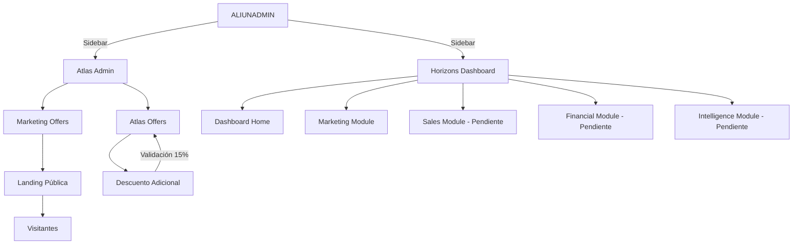

# 📊 Atlas Project Roadmap

> **Sistema de gestión de ofertas hoteleras con validaciones financieras enterprise-level y descuentos negociados**

[](https://github.com)
[](https://github.com)
[](https://github.com)
[](https://github.com)

**Última actualización:** 21 de Febrero 2026  
**Director:** Aldo Hilario  
**Aliun Travel SRL**

---

## 📑 Tabla de Contenidos

- [Resumen Ejecutivo](#-resumen-ejecutivo)
- [Logros del Día](#-logros-del-día-21-febrero-2026)
- [Estado Actual](#-estado-actual-del-proyecto)
- [Roadmap por Fases](#-roadmap-por-fases)
- [Checklist Master](#-checklist-master)
- [Prioridades Inmediatas](#-prioridades-inmediatas)
- [Cronograma](#-cronograma-estimado)
- [Stack Tecnológico](#-stack-tecnológico)

---

## 🎯 Resumen Ejecutivo

El proyecto Atlas es un sistema integral de gestión de ofertas hoteleras que incluye:

- **Marketing Offers:** Sistema público de ofertas con validaciones financieras
- **Descuento Adicional:** Sistema de negociación con protección de margen mínimo 15%
- **Horizons Dashboard:** Panel centralizado de control y métricas
- **Agente IA:** Integración con agente conversacional para ventas automatizadas

### Progreso Global

| Componente | Completitud |
|------------|-------------|
| Backend | 60% ✅ |
| Frontend | 40% ⏳ |
| Integración | 30% ⏳ |
| Documentación | 80% ✅ |

---

## 🎉 Logros del Día (21 Febrero 2026)

### Backend Completado

- [x] **Descuento Adicional** - Sistema completo con validaciones enterprise
  - 6 columnas nuevas en `atlas_offers`
  - 2 RPCs: `rpc_apply_additional_discount`, `rpc_get_discount_info`
  - 1 Vista: `v_discount_audit`
  - Validación margen mínimo 15% garantizada
  - Umbrales de aprobación: 0-5%, 5-10%, 10%+
  - Tests completos ejecutados ✅

### Frontend Completado

- [x] **Atlas Admin** - Panel de gestión integrado
  - Layout propio con sidebar
  - Páginas de listado, creación y edición
  - Integrado en ALIUNADMIN
  
- [x] **Horizons Dashboard** - Panel centralizado
  - `HorizonsLayout.jsx` con navegación completa
  - `DashboardHome.jsx` con KPIs y acciones rápidas
  - Estructura modular para 5 módulos
  
- [x] **Marketing Offers** - Sistema de ofertas públicas
  - `CreateOfferForm.jsx` con validaciones financieras
  - `MarketingOffersPanel.jsx` con gestión completa
  - Landing pública `/destinos/ofertas` operativa

### Correcciones Aplicadas

- [x] Error 404 (rutas no registradas) → Resuelto
- [x] Error `'cn' is not defined` → Función creada en `/lib/cn.js`
- [x] Vista de auditoría mostrando valores incorrectos → Corregida

---

## 📊 Estado Actual del Proyecto

### Arquitectura del Sistema



### Backend - Componentes Operativos

| Módulo | Tablas | RPCs | Vistas | Triggers | Estado |
|--------|--------|------|--------|----------|--------|
| **Core (Bloque A)** | 5 | 6 | 0 | 1 | ✅ 100% |
| **Marketing** | 1 | 2 | 1 | 3 | ✅ 100% |
| **Descuento Adicional** | +6 cols | 2 | 1 | 0 | ✅ 100% |
| **Sales (Bloque B)** | - | - | - | - | ⏳ 0% |
| **Intelligence (Bloque D)** | - | - | - | - | ⏳ 0% |
| **TOTAL** | **6** | **10** | **2** | **4** | **60%** |

### Frontend - Componentes Operativos

| Módulo | Componentes | Estado |
|--------|-------------|--------|
| Atlas Admin | 5+ | ✅ 100% |
| Marketing Offers | 2 | ✅ 100% |
| Descuento Adicional | 1 | ✅ 100% |
| Horizons Dashboard | 2 | ✅ 100% |
| Sales UI | - | ⏳ 0% |
| Financial UI | - | ⏳ 0% |
| Intelligence UI | - | ⏳ 0% |
| **TOTAL** | **10+** | **40%** |

---

## 🗺️ Roadmap por Fases

### Fase 1: Ajustes Finos (1-2 días) ⏳

**Prioridad:** 🔴 ALTA

#### Marketing Offers

- [ ] Corregir `discount_percentage` → entero (no decimales)
- [ ] Formato dos decimales en precios USD → `.toFixed(2)`
- [ ] Confirmar moneda USD por defecto
- [ ] Documentar estructura de precios

#### Descuento Adicional

- [ ] Integrar `AdditionalDiscountPanel.jsx` en proyecto
- [ ] Probar flujo completo en producción
- [ ] Capacitar equipo comercial

#### Horizons Dashboard

- [ ] Integrar `HorizonsLayout.jsx` y `DashboardHome.jsx`
- [ ] Configurar rutas
- [ ] Verificar navegación completa

---

### Fase 2: Integración Agente IA (2-3 días) ⏳

**Prioridad:** 🔴 ALTA

- [ ] Crear endpoint `/api/offers/active`
- [ ] Modificar agente n8n (herramienta "consultar_ofertas")
- [ ] Probar flujo: consulta → ofertas → respuesta
- [ ] Tests con casos reales
- [ ] Documentar integración

**Objetivo:** Agente IA recomendando ofertas reales del sistema

---

### Fase 3: Tracking y Métricas (2-3 días) ⏳

**Prioridad:** 🟡 MEDIA

- [ ] Crear tabla `offer_interactions` en Supabase
- [ ] RPC para registrar interacciones
- [ ] Implementar tracking en landing
- [ ] Implementar tracking desde agente IA
- [ ] Dashboard de métricas en Horizons
- [ ] Gráficas: vistas, clics, conversiones

---

### Fase 4: Sales Module - Bloque B (3-5 días) ⏳

**Prioridad:** 🔴 ALTA

#### Sales Offers Module

- [ ] `SalesOffersPanel.jsx` - UI gestión ofertas venta
- [ ] Integración con Descuento Adicional
- [ ] Validaciones comerciales
- [ ] Panel de cotizaciones

#### Bloqueos Module

- [ ] Sistema de bloqueos de inventario
- [ ] Gestión de fechas límite
- [ ] Validación de disponibilidad
- [ ] Liberación automática

#### Confirmaciones Module

- [ ] Panel de confirmaciones manuales
- [ ] Integración con trigger `confirmed`
- [ ] Workflow de aprobación
- [ ] Notificaciones automáticas

---

### Fase 5: Financial UI (2-3 días) ⏳

**Prioridad:** 🟡 MEDIA

- [ ] `FinancialDashboard.jsx` - UI para `rpc_get_atlas_dashboard`
- [ ] Gráficas ingresos proyectados vs confirmados
- [ ] Panel de fees absorbidos
- [ ] Sistema de reportes mensuales
- [ ] Exportación PDF/Excel

---

### Fase 6: Intelligence Module - Bloque D (5-7 días) ⏳

**Prioridad:** 🟢 BAJA

- [ ] `HotelScoresPanel.jsx` - Sistema de puntuación
- [ ] `InvestmentAnalysisPanel.jsx` - Análisis ROI
- [ ] Algoritmos de scoring
- [ ] Predicciones de demanda
- [ ] Optimización de inventario

---

### Fase 7: Mejoras UX (2-3 días) ⏳

**Prioridad:** 🟢 BAJA

- [ ] Filtros avanzados en listados
- [ ] Búsqueda mejorada
- [ ] Diseño mejorado de landing
- [ ] Personalización de Horizons Dashboard
- [ ] Sistema de favoritos
- [ ] Compartir en redes sociales

---

## ✅ Checklist Master

### Completados Hoy (21 Feb)

#### Backend

- [x] 6 columnas en `atlas_offers` (descuento adicional)
- [x] RPC `rpc_apply_additional_discount`
- [x] RPC `rpc_get_discount_info`
- [x] Vista `v_discount_audit`
- [x] Índices de performance
- [x] Tests completos ejecutados y pasados

#### Frontend

- [x] `HorizonsLayout.jsx`
- [x] `DashboardHome.jsx`
- [x] `AdditionalDiscountPanel.jsx`
- [x] Correcciones en `CreateOfferForm.jsx`
- [x] Correcciones en `MarketingOffersPanel.jsx`

#### Documentación

- [x] `INVENTARIO_HORIZONS.md`
- [x] `DESCUENTO_ADICIONAL_CERTIFICACION.md`
- [x] `AJUSTES_ESTRUCTURA_REAL.md`

### Pendientes - Fase 1 (Alta Prioridad)

#### Marketing Offers

- [ ] **P1** - Corregir `discount_percentage` → entero
- [ ] **P1** - Formato dos decimales en precios
- [ ] **P2** - Documentar moneda USD
- [ ] **P2** - Validar campos de precio

#### Descuento Adicional

- [ ] **P1** - Integrar `AdditionalDiscountPanel.jsx`
- [ ] **P1** - Probar en producción
- [ ] **P2** - Capacitar equipo comercial
- [ ] **P3** - Crear manual de uso

#### Horizons

- [ ] **P1** - Integrar HorizonsLayout + DashboardHome
- [ ] **P1** - Configurar rutas
- [ ] **P2** - Tests de navegación
- [ ] **P3** - Ajustes de diseño

### Pendientes - Fase 2 (Alta Prioridad)

- [ ] **P1** - Crear endpoint `/api/offers/active`
- [ ] **P1** - Modificar agente n8n
- [ ] **P1** - Probar flujo completo
- [ ] **P2** - Tests con casos reales
- [ ] **P2** - Documentar integración

### Pendientes - Fase 3 (Media Prioridad)

- [ ] **P2** - Crear tabla `offer_interactions`
- [ ] **P2** - RPC de tracking
- [ ] **P2** - Implementar en landing
- [ ] **P2** - Implementar en agente
- [ ] **P3** - Dashboard de métricas

---

## 🎯 Prioridades Inmediatas

### Próximos 3 Días

#### Día 1: Ajustes + Integración

```
□ Corregir campos Marketing Offers (2h)
□ Integrar AdditionalDiscountPanel (1h)
□ Integrar Horizons Layout + Home (2h)
□ Tests de integración (1h)

OBJETIVO: Todo el frontend integrado y funcionando
```

#### Día 2: Agente IA

```
□ Crear endpoint /api/offers/active (1h)
□ Modificar agente n8n (3h)
□ Probar flujo completo (2h)
□ Ajustes basados en tests (2h)

OBJETIVO: Agente recomendando ofertas reales
```

#### Día 3: Tracking + Validación

```
□ Crear tabla offer_interactions (1h)
□ Implementar tracking en landing (2h)
□ Implementar tracking en agente (2h)
□ Validación completa del sistema (3h)

OBJETIVO: Sistema completo con métricas
```

---

## 📅 Cronograma Estimado

| Semana | Fechas | Tareas | Completitud |
|--------|--------|--------|-------------|
| **Semana 1** | 22-28 FEB | Ajustes finos, Agente IA, Tracking básico | 40% → 60% |
| **Semana 2** | 1-7 MAR | Sales Module, Financial UI | 60% → 80% |
| **Semana 3** | 8-14 MAR | Intelligence Module, Mejoras UX | 80% → 95% |
| **Semana 4** | 15-21 MAR | Optimizaciones, Documentación, Capacitación | 95% → 100% |

---

## 🚨 Observaciones Críticas

### Moneda

⚠️ **USD es la moneda base en todo el sistema**
- Conversión a DOP solo visual (usando `exchange_rates`)
- Todos los cálculos financieros en USD
- Agente IA puede mostrar ambas monedas

### Validaciones Financieras

🛡️ **NO TOCAR los triggers de validación (certificados)**
- Margen mínimo 15% es intocable
- Umbrales de descuento son fijos
- Bloque A (Core Financiero) es sagrado

### Arquitectura

📐 **Separación de responsabilidades**
- Horizons → Dashboard central
- Atlas Admin → Gestión de ofertas
- Landing pública → Clientes finales
- Agente IA → Consume APIs/RPCs

---

## 💻 Stack Tecnológico

### Backend

- **Database:** Supabase (PostgreSQL)
- **Functions:** PostgreSQL RPCs + Triggers
- **Auth:** Supabase Auth

### Frontend

- **Framework:** Next.js / React
- **Styling:** Tailwind CSS
- **State Management:** React Hooks
- **Forms:** React Hook Form (si aplica)

### Integración

- **n8n:** Automatización y Agente IA
- **APIs:** REST + Supabase RPCs
- **Webhooks:** n8n workflows

---

## 🏆 Hitos Alcanzados

- ✅ **21 FEB:** Descuento Adicional Production Ready
- ✅ **21 FEB:** Horizons Dashboard Base Creado
- ✅ **21 FEB:** Marketing Offers Operativo
- ✅ **21 FEB:** Landing Pública Funcionando
- ✅ **21 FEB:** Atlas Admin Integrado

### Próximo Hito

🎯 **24 FEB:** Agente IA recomendando ofertas reales

---

## 📞 Contacto y Soporte

**Director:** Aldo Hilario  
**Empresa:** Aliun Travel SRL  
**Proyecto:** Atlas - Sistema de Gestión de Ofertas Hoteleras

---

## 📄 Licencia

Proprietary - Aliun Travel SRL © 2026

---

**Última actualización:** 21 de Febrero 2026  
**Versión:** 1.0.0
